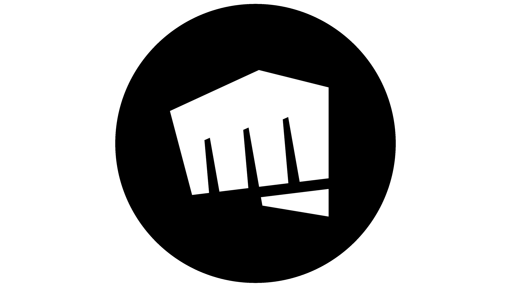

    
    <h3 align="center" size>
        BRiot
    </h3>
    
Unofficial API implementation for Riot League of Legends APIs

## Good to Know
All documentation about their REST API can be found at [Riot Developer Portal](https://developer.riotgames.com/). This project aims to implement all available and documented endpoints related to League of Legends, as specified on the portal. No additional endpoints or functionalities outside the documented scope will be included.

